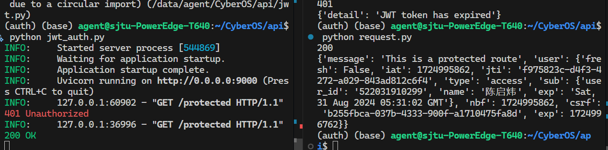

# Auth 部分说明

> Auth: <Kiwi qiweic10@sjtu.edu.cn>

## 总体说明

``static``与``templates``目录为存放HTML和CSS文件的文件夹。
``.env.examle``是演示用的环境变量。
``auth.py``为代码主要部分。
``Makefile``为方便运行用。
``nohup.out``是输出日志。

以下代码运行环境为conda 的``auth``环境

## 总体逻辑

目前使用JAccount作为登录方式，运行auth.py后，可以访问``http://api.emagen.cn/auth``来登录，按下按钮后跳转jaccount登录界面登录，登录成功后展示一个token,前端实际请求时自行保留该token。
该token目前储存信息为user_id,name,exp（过期时间）
前端储存该token后，后续需要验证身份操作时，将该token写在请求header后，
``` py
jwt_token = "xxx"

# 设置请求头
headers = {
    "Authorization": f"Bearer {jwt_token}"
}
```

后端接收请求时调用/data/agent/CyberOS/api/jwt_auth.py中的verify_jwt函数进行验证，具体的调用逻辑写在示例代码中。

关于请求的示例代码

/data/agent/CyberOS/api/jwt_auth.py   （验证请求）
/data/agent/CyberOS/api/request.py    （发起请求）

## 运行方法

运行jaccount登录来获取token：

在当前目录下
1. 暂停运行 ``sudo make stop``
2. 开始运行
    1. 设置环境变量 ``source .env.example``
    2. 开始运行  ``make run``


运行示例api的鉴权python jwt_auth.py  在/data/agent/CyberOS/api/ 路径

运行示例请求api，python request.py  在/data/agent/CyberOS/api/ 路径
